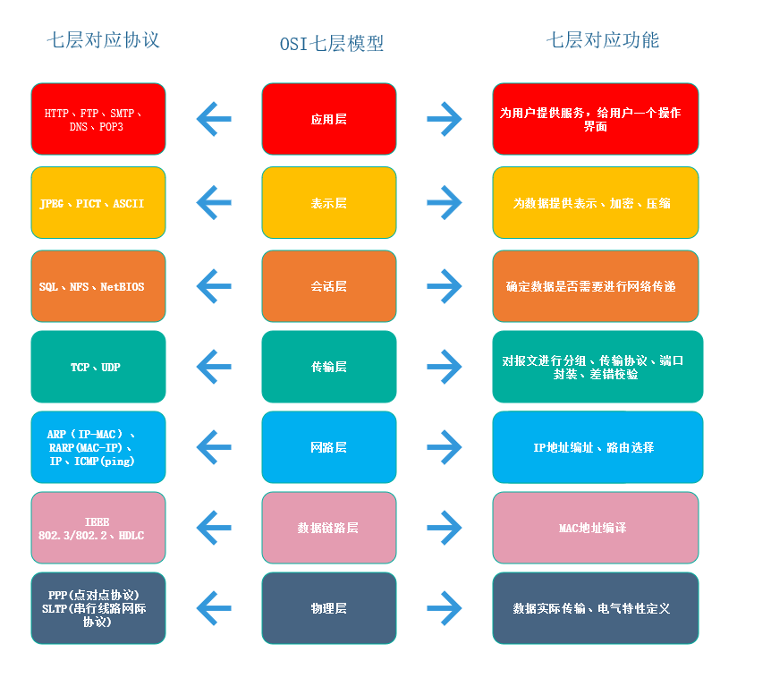
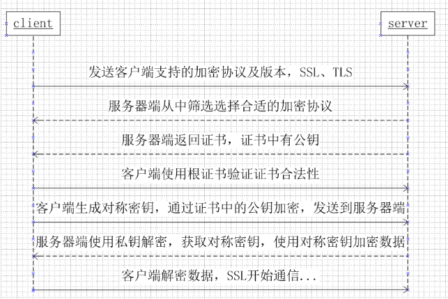

​                                                                                                                                                                    

# 浏览器缓存


https://www.cnblogs.com/ranyonsue/p/8918908.html

### http缓存详解

https://www.jianshu.com/p/227cee9c8d15


#               跨域 

**请求跨域了，那么请求到底发出去没有？**

**跨域并不是请求发不出去，请求能发出去，服务端能收到请求并正常返回结果，只是结果被浏览器拦截了**。

https://www.cnblogs.com/fundebug/p/10329202.html

jsonp原理

**利用 <script> 标签没有跨域限制的漏洞，网页可以得到从其他来源动态产生的 JSON 数据。JSONP请求一定需要对方的服务器做支持才可以。**

**2) JSONP和AJAX对比**

JSONP和AJAX相同，都是客户端向服务器端发送请求，从服务器端获取数据的方式。但AJAX属于同源策略，JSONP属于非同源策略（跨域请求）

**3) JSONP优缺点**

JSONP优点是简单兼容性好，可用于解决主流浏览器的跨域数据访问的问题。**缺点是仅支持get方法具有局限性,不安全可能会遭受XSS攻击。**


cors

服务端设置 `Access-Control-Allow-Origin` 就可以开启 CORS。 该属性表示哪些域名可以访问资源，如果设置通配符则表示所有网站都可以访问资源。

# 当面试官问到，请你说说看“从输入 URL 到页面展示，这中间发生了什么？”

​	https://www.cnblogs.com/chrislinlin/p/12629820.html

用户在浏览器的地址栏输入访问的URL地址。浏览器会先根据这个URL查看浏览器缓存-系统缓存-路由器缓存，若缓存中有，直接跳到第6步操作，若没有，则按照下面的步骤进行操作。

浏览器根据输入的URL地址解析出主机名。

浏览器将主机名转换成服务器ip地址。浏览器先查找本地DNS缓存列表，看缓存里面是否存在这个ip,如果有则进入第4步，如果缓存中不存在这个ip地址，就再向浏览器默认的DNS服务器发送查询请求，同时缓存当前这个ip到DNS缓存列表中。更详细步骤参考[DNS查找域名的过程](http://www.cnblogs.com/xsilence/p/6035559.html)。

拿到ip地址后，浏览器再从URL中解析出端口号。

拿到ip和端口后，浏览器会建立一条与目标Web服务器的TCP连接，也就是传说中的三次握手。传送门：[完整的tcp链接](http://www.cnblogs.com/xsilence/p/6034361.html)。

浏览器向服务器发送一条HTTP请求报文。

服务器向浏览器返回一条HTTP响应报文。

关闭连接 浏览器解析文档。

如果文档中有资源则重复6、7、8动作，直至资源全部加载完毕。

查看是否https

是就TLS连接不是就TCP连接

发送http请求

从服务器获取数据到网络进程

# http1 和1.1 的区别

1.1持久连接(长连接)、节约带宽、HOST域、管道机制、分块传输编码  2015年前使用最广泛  

HTTP/2  2015年  多路复用、服务器推送、头信息压缩、二进制协议等

# 对数组本身有影响的汇总

pop push  slice shift unshift 

# new命令进行了什么操作

1. 创建一个空对象，作为将要返回的对象实例。

2. 将这个空对象的原型，指向构造函数的`prototype`属性。

3. 将这个空对象赋值给函数内部的`this`关键字。

4. 开始执行构造函数内部的代码。

   ```js
   function _new(/* 构造函数 */ constructor, /* 构造函数参数 */ params) {
     // 将 arguments 对象转为数组
     var args = [].slice.call(arguments);
     // 取出构造函数
     var constructor = args.shift();
     // 创建一个空对象，继承构造函数的 prototype 属性
     var context = Object.create(constructor.prototype);
     // 执行构造函数
     var result = constructor.apply(context, args);
     // 如果返回结果是对象，就直接返回，否则返回 context 对象
     return (typeof result === 'object' && result != null) ? result : context;
   }
   
   // 实例
   var actor = _new(Person, '张三', 28);
   ```

# 严格模式

禁用with

全局this 为undefined

禁止在函数内部遍历调用栈如：arguments

禁止删除变量

显示报错

重名错误：函数不能重名的参数，对象不能有重名的属性

禁止8禁止表示法

保留字public yield protected

函数必须声名在顶层

全局变量显示声名


# 对象的深浅拷贝

浅拷贝，如果出现了对象内嵌套对象，则得到的新对象是对象的引用，即原来的对象改变后，拷贝的对象也会改变。

使用方法 Object.assign() 第一个是目标对象，后面的是源对象，注意只拷贝可枚举属性，不继承

```js
var obj = { a:1, arr: [2,3] };
var shallowObj = shallowCopy(obj);

function shallowCopy(src) {
  var dst = {};
  for (var prop in src) {
    if (src.hasOwnProperty(prop)) {
      dst[prop] = src[prop];
    }
  }
  return dst;
}

作者：知乎用户
链接：https://www.zhihu.com/question/23031215/answer/46220227
来源：知乎
著作权归作者所有。商业转载请联系作者获得授权，非商业转载请注明出处。
```

深拷贝 对于对象内的嵌套对象，开辟新栈来存储这个对象，但是深拷贝用的不多，对于多层对象是拷贝会导数运行变慢

常用方法1：JSON 缺点：set map date等一些数据结构会丢失

```js
let a = {b:{c:22}}
let copy = JSON.parse(JSON.stringify(a))
```

方法2：递归

```js
function shen (source){
  if(typeof source !=='object' || source===null)
  return source
  let target = Array.isArray(source)?[]:{}
  for(let i in source){
    if(source.hasOwnProperty(i)){
      if(typeof source[i]==='object'){
        target[i] = shen(source[i])
      }else{
        target[i] = source[i]
      }
    }
  }
  return target
}
```


# 原型链继承 	

 

# 数组扁平化

# 手撕promise all race

# promise 的缺点

件的特点是，如果你错过了它，再去监听，是得不到结果的。

`Promise`也有一些缺点。首先，无法取消`Promise`，一旦新建它就会立即执行，无法中途取消。其次，如果不设置回调函数，`Promise`内部抛出的错误，不会反应到外部。第三，当处于`pending`状态时，无法得知目前进展到哪一个阶段（刚刚开始还是即将完成）。

 

# vue router架构、vuex架构、vue架构


# 属性的遍历

ES6 一共有 5 种方法可以遍历对象的属性。

**（1）for...in**

`for...in`循环遍历对象自身的和继承的可枚举属性（不含 Symbol 属性）。

**（2）Object.keys(obj)**

`Object.keys`返回一个数组，包括对象自身的（不含继承的）所有可枚举属性（不含 Symbol 属性）的键名。

**（3）Object.getOwnPropertyNames(obj)**

`Object.getOwnPropertyNames`返回一个数组，包含对象自身的所有属性（不含 Symbol 属性，但是包括不可枚举属性）的键名。

**（4）Object.getOwnPropertySymbols(obj)**

`Object.getOwnPropertySymbols`返回一个数组，包含对象自身的所有 Symbol 属性的键名。

**（5）Reflect.ownKeys(obj)**

`Reflect.ownKeys`返回一个数组，包含对象自身的所有键名，不管键名是 Symbol 或字符串，也不管是否可枚举。

 

以上的 5 种方法遍历对象的键名，都遵守同样的属性遍历的次序规则。

- 首先遍历所有数值键，按照数值升序排列。

- 其次遍历所有字符串键，按照加入时间升序排列。

- 最后遍历所有 Symbol 键，按照加入时间升序排列。

  # super 关键字
  
  我们知道，`this`关键字总是指向函数所在的当前对象，ES6 又新增了另一个类似的关键字`super`，指向当前对象的原型对象。

# 动画CSS

# 将数组扁平化、去重、从小到大排序。

### 扁平化

```js
function bianping(arr){
  let res=[]
  arr.toString().split(',').map(item=>{
    return +item//用+来返回Number类型的
  })
}
```

### 去重

```js
//es6
function es6(arr){
  return Array.from(new Set(arr))
}
//es5
function es5(arr){
  for(let i=0;i<arr.length;i++){
    for(let j=i+1;j<arr.length;j++){
      if(arr[j]==a[i]){
        arr.splice(j,1)
        j--
      }
    }
  }
  return arr
}
```


# 实现Array.prototype.reduce,map,filter

```js
// map 方法 
function map(arr,callback) {
  //首先检查一下参数
  let flag = !Array.isArray(arr) || !arr.length || typeof callback !=='function'
  if(flag){
    return  []
  }else{
    //每次调用我们都会返回一个新数组
    let newArr = []
    for(let i = 0; i<arr.length;i++){
      //这里callback三个值对应map函数的三个参数
     newArr[i] = callback(arr[i], i, arr)
    }
    return newArr
  }
 }
 let allArr = [1,2,3,4,5]
 console.log(map(allArr,(item)=>item+1))


 // filter // 方法
function filter(arr,callback) {
  let flag = !Array.isArray(arr) || !arr.length || typeof callback !=='function'
if(flag){
  return []
}else{
  let newArr = []
  for (let index = 0; index < arr.length; index++) {
       if(callback(arr[index],index,arr)){
         newArr.push(arr[index])
       }
    
  }
  return newArr
}
  
}
console.log(filter(allArr,(item)=>item>2))

// reduce 方法

function reduce(arr,callback,initValue) {
  let flag = !Array.isArray(arr) || !arr.length || typeof callback !=='function'
   if(flag){
     return []
   }else{
    //  判断有没有初始值
    let isValue = initValue ===0?(!initValue):(!!initValue)
    let reduceValue = isValue?initValue:arr[0]
    console.log(isValue);
    console.log(reduceValue);
//  判断其实相加的值
    for (let index =isValue?0:1; index < arr.length; index++) {
      reduceValue = callback(reduceValue, arr[index],index, arr)
    }
    return reduceValue

   }
   
}
console.log(reduce(allArr,(x,y)=>x+y,10))  //15
```


# OSI七层模型协议各层



# HTTP1 1.1 2.0 3.0

HTTP 1.0

短连接：每次发送请求都要重新建立tcp请求，即三次握手，非常浪费性能

无host头域，也就是http请求头里的host，

不允许断点续传，而且不能只传输对象的一部分，要求传输整个对象

 

HTTP 1.1

长连接，流水线，使用==connection:keep-alive==使用长连接，与http 2.0不同的是，

host头域

由于长连接会给服务器造成压力

 

HTTP 2.0

头部压缩，双方各自维护一个header的索引表，使得不需要直接发送值，通过发送key缩减头部大小

多路复用，使用多个stream，每个stream又分帧传输，使得一个tcp连接能够处理多个http请求

可以使用服务端推送

 

HTTP 3.0

基于google的QUIC协议，而quic协议是使用udp实现的

减少了tcp三次握手时间，以及tls握手时间

解决了http 2.0中前一个stream丢包导致后一个stream被阻塞的问题

优化了重传策略，重传包和原包的编号不同，降低后续重传计算的消耗

连接迁移，不再用tcp四元组确定一个连接，而是用一个64位随机数来确定这个连接

更合适的流量控制

# 注意暂时性死区

```js
 var value = 20;
(function(){
  console.log(name);
  console.log(value);//暂时性死区
  var name = 'local value'
  let value = 21
})();
```

# a又是1又是2又是3

```js
var a = {
  i: 1,
  valueOf: function() {
    return this.i++;
  }
}
if(a == 1 && a == 2 && a == 3) {
  console.log(a); // { i: 4, valueOf: [Function: valueOf] } 输出 a 对象，注意 i 的值
}
```


# dns查询过程，使用的协议

- 1.Chrome浏览器 会首先搜索浏览器自身的DNS缓存
- 2.如果浏览器自身的缓存里面没有找到对应的条目，那么Chrome会搜索操作系统自身的DNS缓存,如果找到且没有过期则停止搜索解析到此结束.
- 如果在Windows系统的DNS缓存也没有找到，那么尝试读取hosts文件
- 如果在hosts文件中也没有找到对应的条目，浏览器就会发起一个DNS的系统调用，就会向本地配置的首选DNS服务器（一般是电信运营商提供的，也可以使用像Google提供的DNS服务器）发起域名解析请求

# 词法作用域

# render函数\diff算法

# 矩阵路径

# 正则

# 减少重绘与回流

获取一个元素的scrollTop、scrollLeft、scrollWidth、offsetTop、offsetLeft、offsetWidth、offsetHeight之类的属性，浏览器为了保证值的正确也会回流取得最新的值

# [Content-Type四种常见取值](https://www.cnblogs.com/fighter007/p/10917026.html)

### [text/html与text/plain有什么区别 - 百度知道](https://www.baidu.com/link?url=GTANMx7gJWLucP8IAYvFoagR6zn_dNYGZ5OmIv-ZZcE5lxd2ObtHx44MIGDQYdSsgywP4b3_aINKP8CqAuqkwPwoP6tnp3yI_FF4Kdukp4u&wd=&eqid=cb8509b70010177c000000025f5d69e2)

# Https建立链接的过程

s


# promise generator async


# link和@import的区别

- link 是一种 HTML 标签，[@import](https://github.com/import) 是一种 CSS 规则；
- link 会和页面一起加载，[@import](https://github.com/import) 在页面加载完成后才加载；
- link 没有兼容性问题，[@import](https://github.com/import) IE5以下不支持;
- link 引入的样式可以直接进行 DOM 修改，[@import](https://github.com/import) 引入的样式不能直接通过 DOM 修改；

# 箭头函数和普通函数的区别

- 箭头函数的this是在定义时获取的，根据上下文确定this
- 箭头函数没有原型属性
- 箭头函数不能当构造函数
- 箭头函数不能当generator函数不能使用 yeild
- 箭头函数不绑定arguments

# 快速排序

```js
var quickSort = function(arr) {
	
　　if (arr.length <= 1) { return arr; }

　　var pivotIndex = Math.floor(arr.length / 2);

　　var pivot = arr.splice(pivotIndex, 1)[0];

　　var left = [];

　　var right = [];

　　for (var i = 0; i < arr.length; i++){

　　　　if (arr[i] < pivot) {

　　　　　　left.push(arr[i]);

　　　　} else {

　　　　　　right.push(arr[i]);

　　　　}

　　}

　　return quickSort(left).concat([pivot], quickSort(right));

};
```

# http状态码

302 301

# 虚拟dom

# math

Math.ceil 向上取整

Math.floor 向下取整

Math.round 四舍五入取整

## Vue的路由实现：hash模式 和 history模式

**hash模式：**在浏览器中符号“#”，#以及#后面的字符称之为hash，用window.location.hash读取；
特点：hash虽然在URL中，但不被包括在HTTP请求中；用来指导浏览器动作，对服务端安全无用，hash不会重加载页面。
hash 模式下，仅 hash 符号之前的内容会被包含在请求中，如 [http://www.xxx.com](http://www.xxx.com/)，因此对于后端来说，即使没有做到对路由的全覆盖，也不会返回 404 错误。

**history模式：**history采用HTML5的新特性；且提供了两个新方法：pushState（），replaceState（）可以对浏览器历史记录栈进行修改，以及popState事件的监听到状态变更。
history 模式下，前端的 URL 必须和实际向后端发起请求的 URL 一致，如 http://www.xxx.com/items/id。后端如果缺少对 /items/id 的路由处理，将返回 404 错误。**Vue-Router 官网里如此描述：**“不过这种模式要玩好，还需要后台配置支持……所以呢，你要在服务端增加一个覆盖所有情况的候选资源：如果 URL 匹配不到任何静态资源，则应该返回同一个 index.html 页面，这个页面就是你 app 依赖的页面。”

# keep-alive新生命周期

**1. activated**

      在 keep-alive 组件激活时调用
      该钩子函数在服务器端渲染期间不被调用

  **2. deactivated**

      在 keep-alive 组件停用时调用
      该钩子在服务器端渲染期间不被调用

    被包含在 keep-alive 中创建的组件，会多出两个生命周期的钩子: activated 与 deactivated

    使用 keep-alive 会将数据保留在内存中，如果要在每次进入页面的时候获取最新的数据，需要在 activated 阶段获取数据，承担原来 created 钩子函数中获取数据的任务。

# vue自定义新的指令

```js
var app = new Vue({
    el: '#app',
    data: {    
    },
    // 创建指令(可以多个)
    directives: {
        // 指令名称
        dir1: {
            inserted(el) {
                // 指令中第一个参数是当前使用指令的DOM
                console.log(el);
                console.log(arguments);
                // 对DOM进行操作
                el.style.width = '200px';
                el.style.height = '200px';
                el.style.background = '#000';
            }
        }
    }
})
```

```js
Vue.directive('dir2', {
    inserted(el) {
        console.log(el);
    }
})
```

```js
<div id="app">
    <div v-dir1></div>
    <div v-dir2></div>
</div>
```


# 一个简单的双向绑定

```html
<!DOCTYPE html>
<html lang="en">
<head>
  <meta charset="UTF-8">
  <meta name="viewport" content="width=device-width, initial-scale=1.0">
  <title>Document</title>
</head>
<body>
  <input type="text" id='in'>
  <span id='out'></span>
</body>
<script>
  let obj = {
    hello:null
  }
  Object.defineProperty(obj,'hello',{
    set:function(newValue){
      document.getElementById('in').value = newValue
      document.getElementById('out').innerHTML = newValue
    }
  })
  document.getElementById('in').addEventListener('keyup',function(e){
    obj.hello = e.target.value //这里先动然后set 调用改变页面
  })
</script>
</html>
```


# bind的手写

# 封装promise