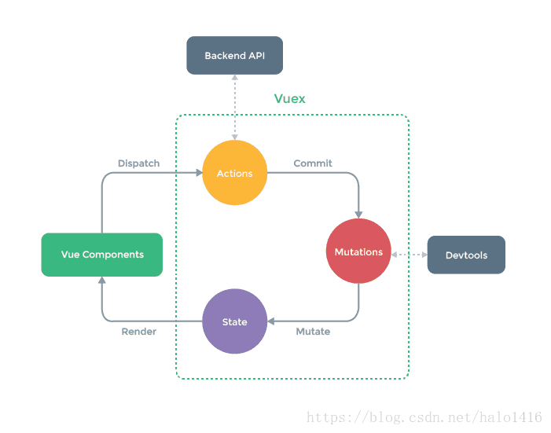

# 网络缓存如何设置请求头

设置cache-control 告诉服务器多久后失效

Expires是表明，在当前时间的120秒后缓存失效

Last-Modified则是说明这个文档最后修改时间。可以看出输出的当前时间

有时候客户端浏览器的时间可能不准确，但是通过Last-Modified，可以提高缓存时间准确性的问题。

# 懒加载的原理、实现

1.第一种是纯粹的延迟加载，使用setTimeOut或setInterval进行加载延迟
2.第二种是条件加载，符合某些条件，或触发了某些事件才开始异步下载。
3.第三种是可视区加载，即仅加载用户可以看到的区域，这个主要由监控滚动条来实现，一般会在距用户看到某图片前一定距离遍开始加载，这样能保证用户拉下时正好能看到图片。


# CDN

内容分发网络。其目的是通过在现有的Internet中增加一层新的**CACHE(缓存)**层，将网站的内容发布到最接近用户的网络**"边缘"**的节点，使用户可以就近取得所需的内容，提高用户访问网站的响应速度。

通过在网络各处放置节点服务器所构成的在现有的互联网基础之上的一层智能虚拟网络，CDN系统能够实时地根据网络流量和各节点的连接、负载状况以及到用户的距离和响应时间等综合信息将用户的请求重新导向离用户最近的服务节点上。

# 如何减少网络请求，为什么要减少网络请求

**只要10%-20%的最终用户响应时间花在接受请求的HTML文档上,剩下的80%-90%的时间都花费在HTML文档所引用的所有组件(图片,Script,css,flash等等)进行的HTTP请求上.**

1. 图片地图

   使用<map><area></area></map>标签来将多个图片的超链接整合到一张大图片上用来减少图片的请求

2. 雪碧图

3. 合并脚本和样式表

4. 将图片转为Base64编码放到html中直接

# 音视频标签

viedo标签和audio标签

使用

```html
<video>

<source src=" " type=" "></source>

<source src=" " type=" "></source>

</video>
```

来获得多个浏览器的适配，中间可以放不同的格式的视频源。

# v-slot，原来的写法将在vue3作废

- 匿名插槽<slot></slot>

- 具名插槽

  实现插槽标签 必须在template中使用

  ```html
  <template v-slot:xxx>
  	<h2>
      这里是插槽xxx的内容
    </h2>
  </template>
  ```

  设置插槽

  ```html
  <slot name='xxx'></slot>
  ```

- 作用域插槽，插槽传值，设置插槽的位置有数据要传给将要实现插槽位置的方法

  这里首先在设置插槽位置使用类似props的传值方法设置

  ```html
  <slot name='test' :xxx='xxx'></slot>
  ```

  使用的时候,使用v-slot后面的=号后的就是接受过来的参数

  ```html
  <template v-solt:test='slotProps'>
    {{slotProps.xxx.data}}
  </template>
  ```

  在上述情况下，当被提供的内容*只有*默认插槽时，组件的标签才可以被当作插槽的模板来使用。这样我们就可以把 `v-slot` 直接用在组件上：

  也可以用es6解构slotProps这样可以直接获取xxx

# Promise.race，promise

# 自己封装一个$toast

```js
想用插件vue,use调用，就要在这个组件的文件夹下面创建一个index.js
import Toast from "@/components/common/toast/Toast";

const obj={}

obj.install=function (Vue) {
  //main.js中使用Vue.use(插件名)
  //就会调用该函数
  //1.创建组件构造器

  const toastConstructor = Vue.extend(Toast)
  //2.用new的方式，根据组件构造器创建一个组件对象
  const toast = new toastConstructor()
  //3.讲组件对象，手动挂载到某一个元素上
  toast.$mount(document.createElement('div'))
  //4.加到body上
  document.body.appendChild(toast.$el)
  console.log(toast);

  Vue.prototype.$toast = toast
  //最终挂载元素，插件封装完成

}
```


# url 提取键值对

# Array.sort()

ort（） 对数组排序，对元素组影响，按Unicode 编码排序

所以默认排序对于纯数字并不准确，我们可以传一个回调函数作为参数来规定排序方法

//a,b 两个形参，浏览器会将数组元素作为实参分别传入
//a永远再b的前面
//根据回调函数的返回值来判断是否交换顺序，如果返回>0的值则交换a,b顺序，<=0位置不变

```js
letarr=[3,5,1,7,3,11,54,33];

//a,b两个形参，浏览器会将数组元素作为实参分别传入

//a永远再b的前面

//根据回调函数的返回值来判断是否交换顺序，如果返回>0的值则交换a,b顺序，<=0位置不变

arr.sort(function(a,b){

returna-b;//升序排列

//returnb-a//降序排列

});
```

# addEventListener和onClick()的区别	`

1.onclick事件在同一时间只能指向唯一对象

2.addEventListener给一个事件注册多个listener

3.addEventListener对任何DOM都是有效的，而onclick仅限于HTML

4.addEventListener可以控制listener的触发阶段，（捕获/冒泡）。对于多个相同的事件处理器，不会重复触发，不需要手动使用removeEventListener清除

5.IE9使用attachEvent和detachEvent

# new Object.create()的区别

new Object()继承内置对象Object，Object.create继承指定对象

可以通过Object.create(null) 创建一个干净的对象，也就是没有原型，而 new Object() 创建的对象是 Object的实例，原型永远指向Object.prototype.

# instance of 的原理

原理是查找原型链在在不在上面

真正使用的代码是内置symbol

Symbol.hasInstance 

```js
class Even {
  static [Symbol.hasInstance](obj) {
    return Number(obj) % 2 === 0;
  }
}

// 等同于
const Even = {
  [Symbol.hasInstance](obj) {
    return Number(obj) % 2 === 0;
  }
};

1 instanceof Even // false
2 instanceof Even // true
12345 instanceof Even // false
```

# class和 es5继承的不同

ES5 的继承，实质是先创造子类的实例对象`this`，然后再将父类的方法添加到`this`上面（`Parent.apply(this)`）。ES6 的继承机制完全不同，实质是先将父类实例对象的属性和方法，加到`this`上面（所以必须先调用`super`方法），然后再用子类的构造函数修改`this`。

在子类的构造函数中，只有调用`super`之后，才可以使用`this`关键字，否则会报错。这是因为子类实例的构建，基于父类实例，只有`super`方法才能调用父类实例。

#  ES6 模块与 CommonJS 模块的差异

它们有两个重大差异。

- CommonJS 模块输出的是一个值的拷贝，ES6 模块输出的是值的引用（import的）。
- CommonJS 模块是运行时加载，ES6 模块是编译时输出接口。

第二个差异是因为 CommonJS 加载的是一个对象（即`module.exports`属性），该对象只有在脚本运行完才会生成。而 ES6 模块不是对象，它的对外接口只是一种静态定义，在代码静态解析阶段就会生成。

## Ajax和Fetch区别

1. fetch是基于promise实现的，也可以结合async/await。
2. fetch请求默认是不带cookie的，需要设置fetch（URL，{credentials:’include’})。
   Credentials有三种参数：same-origin，include，*
3. 服务器返回400 500 状态码时并不会reject，只有网络出错导致请求不能完成时，fetch才会被reject。
4. 所有版本的 IE 均不支持原生 Fetch。
5. fetch是widow的一个方法；

* ajax是使用XMLHttpRequest对象发起的，但是用起来很麻烦，所以ES6新规范就有了fetch，fetch发一个请求不用像ajax那样写一大堆代码。
* 使用fetch无法取消一个请求，这是因为fetch基于Promise，而Promise无法做到这一点。
* fetch没有办法原生监测请求的进度，而XMLHttpRequest可以
* fetch由于是ES6规范，兼容性上比不上XMLHttpRequest

# .如何实现一根0.5px的线

使用transform scale(0.5,0.5)

# CORS

# async和generator的不同

1**内置执行器:** async函数自带执行器,使用方法为 asyncReadFile()

2**更好的语义:** async表示函数里有异步操作,await表示紧跟再后面的表达式需要等待结果

3**更广的适用性:** yield命令后,只能是Thunk函数或Promise对象,而async函数的await命令后面,可以是Promise对象和原始类型的值

4返回值是Promise对象,可以使用then方法指定下一步操作

简单的说async函数就相当于自执行的Generator函数，相当于自带一个状态机，在 await 的部分等待返回， 返回后自动执行下一步。而且相较于Promise，async 的优越性就是把每次异步返回的结果从 then 中拿到最外层的方法中，不需要链式调用，只要用同步的写法就可以了。

比 promise 直观，但是 async 必须以一个 Promise 对象开始 ，所以 async 通常是和Promise 结合使用的。

处。

# 什么是thunk函数

**这就是 Thunk 函数的定义，它是"传名调用"的一种实现策略，用来替换某个表达式。**

**在 JavaScript 语言中，Thunk 函数替换的不是表达式，而是多参数函数，将其替换成单参数的版本，且只接受回调函数作为参数。**

# generator

注意，由于`next`方法的参数表示上一个`yield`表达式的返回值，所以在第一次使用`next`方法时，传递参数是无效的。V8 引擎直接忽略第一次使用`next`方法时的参数，只有从第二次使用`next`方法开始，参数才是有效的。

```js
function* dataConsumer() {
  console.log('Started');
  console.log(`1. ${yield}`);
  console.log(`2. ${yield}`);
  return 'result';
}

let genObj = dataConsumer();
genObj.next();
// Started
genObj.next('a')
// 1. a
genObj.next('b')
// 2. b
```

ES6 提供了`yield*`表达式，作为解决办法，用来在一个 Generator 函数里面执行另一个 Generator 函数。

thunk函数用作generator执行器

```js
function run(fn) {
  var gen = fn();

  function next(err, data) {
    var result = gen.next(data);
    if (result.done) return;
    result.value(next);
  }

  next();
}

function* g() {
  // ...
}

run(g);
```

promise用作执行器

```js
function run(gen){
  var g = gen();

  function next(data){
    var result = g.next(data);
    if (result.done) return result.value;
    result.value.then(function(data){
      next(data);
    });
  }

  next();
}

run(gen);
```

# 判断一个空对象

```js
JSON.stringify(obj)!='{}'
```

# 单点登陆

什么是单点登录？单点登录全称Single Sign On（以下简称SSO），是指在多系统应用群中登录一个系统，便可在其他所有系统中得到授权而无需再次登录，包括单点登录与单点注销两部分

# 原生实现ajax

```js
var Ajax={
  get: function(url, fn) {
    // XMLHttpRequest对象用于在后台与服务器交换数据   
    var xhr = new XMLHttpRequest();            
    xhr.open('GET', url, true);
    xhr.onreadystatechange = function() {
      // readyState == 4说明请求已完成
      if (xhr.readyState == 4 && xhr.status == 200 || xhr.status == 304) { 
        // 从服务器获得数据 
        fn.call(this, xhr.responseText);  
      }
    };
    xhr.send();
  },
  // datat应为'a=a1&b=b1'这种字符串格式，在jq里如果data为对象会自动将对象转成这种字符串格式
  post: function (url, data, fn) {
    var xhr = new XMLHttpRequest();
    xhr.open("POST", url, true);
    // 添加http头，发送信息至服务器时内容编码类型
    xhr.setRequestHeader("Content-Type", "application/x-www-form-urlencoded");  
    xhr.onreadystatechange = function() {
      if (xhr.readyState == 4 && (xhr.status == 200 || xhr.status == 304)) {
        fn.call(this, xhr.responseText);
      }
    };
    xhr.send(data);
  }
}
```

# 2.link和style哪个优先级高？为什么？

没有固定优先级，按就近原则。

# 如何判断一个元素是否出现在视口中

```javascript
var io = new IntersectionObserver(callback, option);
```

上面代码中，`IntersectionObserver`是浏览器原生提供的构造函数，接受两个参数：`callback`是可见性变化时的回调函数，`option`是配置对象（该参数可选）。

构造函数的返回值是一个观察器实例。实例的`observe`方法可以指定观察哪个 DOM 节点。

```js

// 开始观察
io.observe(document.getElementById('example'));

// 停止观察
io.unobserve(element);

// 关闭观察器
io.disconnect();
```

```js

var io = new IntersectionObserver(
  entries => {
    console.log(entries);
  }
);
```

`IntersectionObserverEntry`对象提供目标元素的信息，一共有六个属性。

> ```javascript
> {
>   time: 3893.92,
>   rootBounds: ClientRect {
>     bottom: 920,
>     height: 1024,
>     left: 0,
>     right: 1024,
>     top: 0,
>     width: 920
>   },
>   boundingClientRect: ClientRect {
>      // ...
>   },
>   intersectionRect: ClientRect {
>     // ...
>   },
>   intersectionRatio: 0.54,
>   target: element
> }
> ```

每个属性的含义如下。

> - `time`：可见性发生变化的时间，是一个高精度时间戳，单位为毫秒
> - `target`：被观察的目标元素，是一个 DOM 节点对象
> - `rootBounds`：根元素的矩形区域的信息，`getBoundingClientRect()`方法的返回值，如果没有根元素（即直接相对于视口滚动），则返回`null`
> - `boundingClientRect`：目标元素的矩形区域的信息
> - `intersectionRect`：目标元素与视口（或根元素）的交叉区域的信息
> - `intersectionRatio`：目标元素的可见比例，即`intersectionRect`占`boundingClientRect`的比例，完全可见时为`1`，完全不可见时小于等于`0`

根据视口懒加载也可以由该API实现，在底部放一个footdiv，io.boserve(document.querySelecetAll(.footdiv))

当可见度>0时，加载新的元素

# getBoudingClientRect（）

以下是元素全部在视口中可见的函数，亲测有效

```js
function inViewPort(el) {
    let doc = document.documentElement
    let rect = el.getBoundingClientRect()
    let top = rect.top
    let bottom = rect.bottom
    let left = rect.left
    let right = rect.right
    if(top>0&&bottom<doc.clientHeight&&left>0&&right<doc.clientWidth){
        return true
    }else{
        return false
    }
}
```
以下是元素部分在视口中

```js
function inViewPort(el) {
        let doc = document.documentElement
        let rect = el.getBoundingClientRect()
        let top = rect.top
        let bottom = rect.bottom
        let left = rect.left
        let right = rect.right
        if(top>0&&top<doc.clientHeight&&left>0&&left<doc.clientWidth){
            return true
        }else{
            return false
        }
    }
```

————————————————
版权声明：本文为CSDN博主「星海拾遗」的原创文章，遵循CC 4.0 BY-SA版权协议，转载请附上原文出处链接及本声明。
原文链接：https://blog.csdn.net/qq_38280242/article/details/104945206


# js最大安全整数

Number.MAX_SAFE_INTEGER = 2^53-1

# 两大数相加

```js
const addStrings = (num1, num2) => {
  while (num1.length > num2.length) num2 = '0' + num2;
  while (num1.length < num2.length) num1 = '0' + num1; // 先补0对齐
  let res = '';     // 结果字符串
  let carry = 0;    // 进位
  for (let i = num1.length - 1; i >= 0; i--) { // 加法 从右往左做
    const sum = +num1[i] + +num2[i] + carry;   // +号将字符转数字
    res = sum % 10 + res;                      // 模10的结果 + res字符串
    carry = sum > 9 ? 1 : 0;
  }
  return carry == 1 ? '1' + res : res;
};
```

# 防止css重名

BEM命名规约

三个部分的具体含义为：

- **Block**：页面中的大区域，表示最顶级的划分，例如：轮播图(`banner`)、布局(`layout`)、文章(`article`)等等
- **element**：区域中的组成部分，例如：轮播图中的横幅图片(`banner__img`)、轮播图中的容器（`banner__container`）、布局中的头部(`layout__header`)、文章中的标题(`article_title`)
- **modifier**：可选。通常表示状态，例如：处于展开状态的布局左边栏（`layout__left_expand`）、处于选中状态的轮播图小圆点(`banner__dot_selected`)

在某些大型工程中，如果使用BEM命名法，还可能会增加一个前缀，来表示类名的用途，常见的前缀有：

- **l**: layout，表示这个样式是用于布局的
- **c**: component，表示这个样式是一个组件，即一个功能区域
- **u**: util，表示这个样式是一个通用的、工具性质的样式
- **j**: javascript，表示这个样式没有实际意义，是专门提供给js获取元素使用的

# 微任务

`process.nextTick`这个名字有点误导，它是在本轮循环执行的，而且是所有异步任务里面最快执行的。其实它并不是微任务队里的，是独立出来一个比微任务更早的队列

promise

```javascript
setTimeout(() => console.log(1));
setImmediate(() => console.log(2));
//执行结果不确定
```

# vuex数据流那个图



# HTTP请求响应报文格式

# LRU

# nextTick 

# 详细看一下jsonp

https://blog.csdn.net/hansexploration/article/details/80314948

# TCP和UDP的比较

#### 1. 对比

|              | UDP                                        | TCP                                    |
| :----------- | :----------------------------------------- | :------------------------------------- |
| 是否连接     | 无连接                                     | 面向连接                               |
| 是否可靠     | 不可靠传输，不使用流量控制和拥塞控制       | 可靠传输，使用流量控制和拥塞控制       |
| 连接对象个数 | 支持一对一，一对多，多对一和多对多交互通信 | 只能是一对一通信                       |
| 传输方式     | 面向报文                                   | 面向字节流                             |
| 首部开销     | 首部开销小，仅8字节                        | 首部最小20字节，最大60字节             |
| 适用场景     | 适用于实时应用（IP电话、视频会议、直播等） | 适用于要求可靠传输的应用，例如文件传输 |

# 同源策略

 是由NetScape提出的一个著名的安全策略。所谓的同源,指的是协议,域名,端口相同。浏览器处于安全方面的考虑,只允许本域名下的接口交互,不同源的客户端脚本,在没有明确授权的情况下,不能读写对方的资源。

# bootstrap响应式原理

判断出终端设备的容器宽度，然后选择性的加载吻合大小的网页，也就是媒体查询。媒体查询写在CSS样式代码的最后，CSS是层叠样式表，在同一特殊性下，靠后的的样式会重叠前面的样式。html头部也要写兼容性，例如：<meta name="viewport" content="width=device-width,initial-scale=1,maximum-scale=1,user-scalable=no"/>。注释：

width=device-width:宽度等于当前设备的宽度

initial-scale=1：初始的缩放比例（默认为1）

maximum-scale=1：允许用户缩放到得最大比例（默认为1）

user-scalable=no：用户不能手动缩放

# Cache-Control头各个值的说明

## 请求头

## max-age

客户端不愿意接受age超过这个值的缓存。并且不接受过期缓存，除非max-stale存在。
总是有值

## max-stale

如果有值，客户端可以接受过期时间不超过指定值的缓存
如果没有值，客户端愿意接受过期缓存而无论过期过久。

## min-fresh

客户端愿意接受一个新鲜度不小于当前age加上指定时间的响应。简单说在指定的后续一段时间内不会过期的响应。
总是有值

## no-cache

客户端示意缓存，在使用缓存的时候必须进行校验。
没有值

## no-store

客户端示意缓存，不要存储本次请求的响应。但是对于已经缓存的内容则没有影响。
也就说缓存可以从已缓存的数据中构造本次响应。这里难以理解，下面是rfc7234中关于这部分描述的片段的片段

> https://tools.ietf.org/html/rfc7234#section-5.2.1
> Note that if a request containing this directive is satisfied from a
> cache, the no-store request directive does not apply to the already
> stored response.
>
> https://tools.ietf.org/html/rfc7234#appendix-A
> The “no-store” request directive doesn’t apply to responses; i.e., a
> cache can satisfy a request with no-store on it and does not
> invalidate it.
> 没有值

## no-transform

> https://developer.mozilla.org/zh-CN/docs/Web/HTTP/Headers/Cache-Control
> 不得对资源进行转换或转变。Content-Encoding, Content-Range, Content-Type等HTTP头不能由代理修改。例如，非透明代理可以对图像格式进行转换，以便节省缓存空间或者减少缓慢链路上的流量。 no-transform指令不允许这样做。
> 没有值

## only-if-cached

客户端只接受缓存给出的响应，如果缓存没有命中应该返回一个504
*MDN的中文翻译在这里描述的是“如果缓存存在，…“，对比英文版以及RFC7234中的描述，这个描述是错误的，我已在MDN上进行修改*

> https://tools.ietf.org/html/rfc7234#section-5.2.1
> If it receives this directive, a cache SHOULD either respond using a stored response that is
> consistent with the other constraints of the request, or respond with
> a 504 (Gateway Timeout) status code.

## 响应头

## must-revalidate

一旦缓存过期，必须向源服务器进行校验，不得使用过期内容。如果无法连接必须返回504。
没有值

## no-cache

如果值，在没有成功通过源站校验的情况下不得使用缓存。
有值，在进行验证的时候不要发送值指示的头域。
如`Cache-Control: no-cache="set-cookie,set-cookie2"`，表示不要携带cookie进行验证。
关于带有值的情况介绍较少，这里有一个讨论：[no-cache头带值时](https://www.ibm.com/developerworks/community/forums/html/topic?id=77777777-0000-0000-0000-000000183258)

## no-store

不要缓存当前请求的响应
没有值

## no-transform

与请求头语义相同

> https://developer.mozilla.org/zh-CN/docs/Web/HTTP/Headers/Cache-Control
> 不得对资源进行转换或转变。Content-Encoding, Content-Range, Content-Type等HTTP头不能由代理修改。例如，非透明代理可以对图像格式进行转换，以便节省缓存空间或者减少缓慢链路上的流量。 no-transform指令不允许这样做。
> 没有值

## public

任何缓存都可以进行缓存，即使响应默认是不可缓存或仅私有缓存可存的情况。

## private

没有值，公有缓存不可存储；即使默认是不可缓存的，私有缓存也可以存储
有值，将无值时的作用，限制到指定头字段上。公有有缓存不可存储指定的头字段，而其他字段可以缓存。

## proxy-revalidate

与must-revalidate相同，但仅对公共缓存生效。
没有值

## max-age

在经过指定时间后将过期
有值

## s-maxage

指定响应在公共缓存中的最大存活时间，它覆盖max-age和expires字段。

