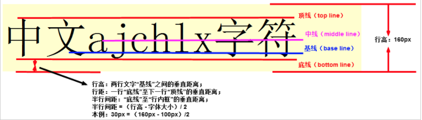
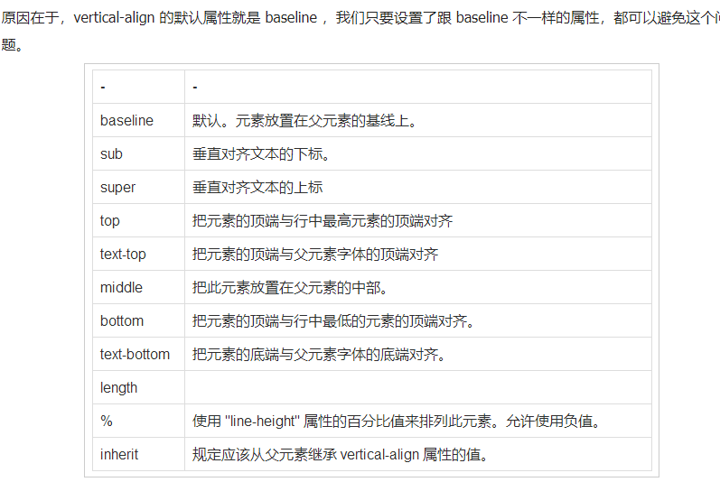
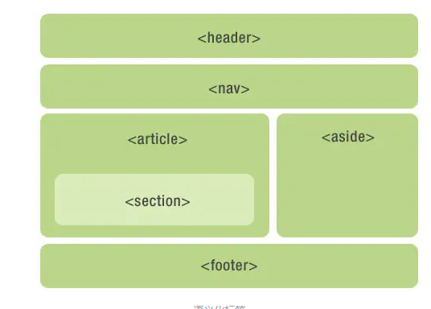

# 垃圾回收

标记-清除算法

- 垃圾回收器获取根并**“标记”**(记住)它们。
- 然后它访问并“标记”所有来自它们的引用。
- 然后它访问标记的对象并标记它们的引用。所有被访问的对象都被记住，以便以后不再访问同一个对象两次。
- 以此类推，直到有未访问的引用(可以从根访问)为止。
- 除标记的对象外，所有对象都被删除。

**1）问什么是垃圾**

一般来说没有被引用的对象就是垃圾，就是要被清除， 有个例外如果几个对象引用形成一个环，互相引用，但根访问不到它们，这几个对象也是垃圾，也要被清除。

# CORS

CORS是一个W3C标准，全称是"跨域资源共享"（Cross-origin resource sharing）。

它允许浏览器向跨源服务器，发出[`XMLHttpRequest`](http://www.ruanyifeng.com/blog/2012/09/xmlhttprequest_level_2.html)请求，从而克服了AJAX只能[同源](http://www.ruanyifeng.com/blog/2016/04/same-origin-policy.html)使用的限制。

### cors 发cookies

```js
var xhr = new XMLHttpRequest();
xhr.withCredentials = true;
```


### 同源的三种限制

（1） Cookie、LocalStorage 和 IndexDB 无法读取。

（2） DOM 无法获得。

（3） AJAX XMLHttpRequest  请求不能发送。

### JSONP和AJAX

1、ajax和jsonp这两种技术在调用方式上”看起来”很像，目的也一样，都是请求一个url，然后把服务器返回的数据进行处理，因此jquery和ext等框架都把jsonp作为ajax的一种形式进行了封装。

2、但ajax和jsonp其实本质上是不同的东西。ajax的核心是通过XmlHttpRequest获取非本页内容，而jsonp的核心则是动态添加

### jsonp原理

后端代码自动生成的，有个callback

```js
<!DOCTYPE html PUBLIC "-//W3C//DTD XHTML 1.0 Transitional//EN" "http://www.w3.org/TR/xhtml1/DTD/xhtml1-transitional.dtd">
<html xmlns="http://www.w3.org/1999/xhtml" >
<head>
     <title>Untitled Page</title>
      <script type="text/javascript" src=jquery.min.js"></script>
      <script type="text/javascript">
     jQuery(document).ready(function(){ 
        $.ajax({
             type: "get",
             async: false,
             url: "http://flightQuery.com/jsonp/flightResult.aspx?code=CA1998",
             dataType: "jsonp",
             jsonp: "callback",//传递给请求处理程序或页面的，用以获得jsonp回调函数名的参数名(一般默认为:callback)
             jsonpCallback:"flightHandler",//自定义的jsonp回调函数名称，默认为jQuery自动生成的随机函数名，也可以写"?"，jQuery会自动为你处理数据
             success: function(json){
                 alert('您查询到航班信息：票价： ' + json.price + ' 元，余票： ' + json.tickets + ' 张。');
             },
             error: function(){
                 alert('fail');
             }
         });
     });
     </script>
     </head>
  <body>
  </body>

```


# HTTP头部详解

### 通用头

Cache-Control、 Connection、Date、Pragma、Transfer-Encoding、Upgrade、Via

### 请求头

Accept、Accept-Charset、Accept- Encoding、Accept-Language、Authorization、From、Host、If-Modified-Since、If- Match、If-None-Match、If-Range、If-Range、If-Unmodified-Since、Max-Forwards、 Proxy-Authorization、Range、Referer、User-Agent

```js
GET http://download.microtool.de:80/somedata.exe
 
Host: download.microtool.de
 
Accept:*/*
 
Pragma: no-cache
 
Cache-Control: no-cache
 
Referer: http://download.microtool.de/
 
User-Agent:Mozilla/4.04[en](Win95;I;Nav)
 
Range:bytes=554554-
```


### 响应头

Age、Location、Proxy-Authenticate、Public、Retry- After、Server、Vary、Warning、WWW-Authenticate

```js
典型的响应消息： 
HTTP/1.0 200 OK 
Date:Mon,31Dec200104:25:57GMT 
Server:Apache/1.3.14(Unix) 
Content-type:text/html 
Last-modified:Tue,17Apr200106:46:28GMT 
Etag:"a030f020ac7c01:1e9f" 
Content-length:39725426 
Content-range:bytes554554-40279979/40279980
```

# Watch

```js
watch: {
    n() {
      console.log("n 变了");
    },
    obj:{
      handler: function (val, oldVal) { 
      console.log("obj 变了")
    },
      deep: true // 该属性设定在任何被侦听的对象的 property 改变时都要执行 handler 的回调，不论其被嵌套多深
    },
    "obj.a":{
      handler: function (val, oldVal) { 
      console.log("obj.a 变了")
    },
      immediate: true // 该属性设定该回调将会在侦听开始之后被立即调用
    }
```

# 导航

1、全局守卫： `router.beforeEach`

2、全局解析守卫： `router.beforeResolve`

3、全局后置钩子： `router.afterEach`

4、路由独享的守卫： `beforeEnter`

5、组件内的守卫： `beforeRouteEnter、beforeRouteUpdate (2.2 新增)、beforeRouteLeave`

`to: Route`: 即将要进入的目标 路由对象

`from: Route`: 当前导航正要离开的路由

`next: Function`: 一定要调用该方法来`resolve`这个钩子。执行效果`依赖 next 方法的调用`参数。

- `next()`: 进行管道中的下一个钩子。如果全部钩子执行完了，则导航的状态就是`confirmed` (确认的)。
- `next(false)`: 中断当前的导航。如果浏览器的 URL 改变了 (可能是用户手动或者浏览器后退按钮)，那么 URL 地址`会重置到 from 路由`对应的地址。
- `next('/') 或者 next({ path: '/' })`: 跳转到一个不同的地址。当前的导航被中断，然后进行一个新的导航。你可以向 `next 传递任意位置对象`，且`允许设置诸如` replace: true、name: 'home' 之类的选项以及任何用在`router-link`的 `to prop`或 `router.push`中的选项。
- `next(error)`: (2.4.0+) 如果传入 next 的参数是一个 Error 实例，则导航会`被终止`且该错误会被传递给 `router.onError()`注册过的回调。

确保要调用 `next`方法，`否则`钩子就`不会被 resolved`

、全局后置钩子

你也可以注册`全局后置钩子`，然而和`守卫不同的是`，这些钩子`不会接受 next 函数`也`不会改变导航本身`：

```
router.afterEach((to, from) => {
  // ...
})
```

```
 beforeRouteUpdate在当前路由改变，但是该组件被复用时调用
    // 举例来说，对于一个带有动态参数的路径 /foo/:id，在 /foo/1 和 /foo/2 之间跳转的时候，
    // 由于会渲染同样的 Foo 组件，因此组件实例会被复用。而这个钩子就会在这个情况下被调用。
    // 可以访问组件实例 `this`
```

## 完整的导航解析流程

1. 导航被触发。
2. 在失活的组件里调用离开守卫。
3. 调用全局的 **`beforeEach`** 守卫。
4. 在重用的组件里调用 **`beforeRouteUpdate`** 守卫 (2.2+)。
5. 在路由配置里调用 `beforeEnter`。
6. 解析异步路由组件。
7. 在被激活的组件里调用 **`beforeRouteEnter`**。
8. 调用全局的 **`beforeResolve`** 守卫 (2.5+)。
9. 导航被确认。
10. 调用全局的 **`afterEach`** 钩子。
11. 触发 DOM 更新。
12. 用创建好的实例调用 **`beforeRouteEnter`** 守卫中传给 **`next`** 的回调函数。

# <font color='red'>get和POSt的区别</font>

1.GET请求的数据会附在URL之后，以?分割URL和传输数据，参数之间以&相连，

POST把提交的数据则放置在是HTTP包的包体中。

2.GET的长度受限于url的长度，而url的长度限制是特定的浏览器和服务器设置的，理论上GET的长度可以无限长。

3.POST是没有大小限制的，HTTP协议规范也没有进行大小限制，起限制作用的是服务器的处理程序的处理能力

4.<font color='red'>get是幂等的，多次刷新只请求一次，post是非幂等的，多次刷新请求多次</font>

5.get请求只发送一次，post先发请求再发包体，本质是两次请求

# 手机物理键值的返回

popstate 一个新的事件

```js
window.addEventListener("popstate",function(e){
        window.location.replace(APP_PATH + "/api/proc/procPending/listProcPending.action");
        //这里指定你要跳转的页面
    });
```

# script标签属性

- 如果 async="async"：脚本相对于页面的其余部分异步地执行（当页面继续进行解析时，脚本将被执行）

- 如果不使用 async 且 defer="defer"：脚本将在页面完成解析时执行

- 如果既不使用 async 也不使用 defer：在浏览器继续解析页面之前，立即读取并执行脚本

- ### defer

  如果你的脚本代码依赖于页面中的`DOM`元素（文档是否解析完毕），或者被其他脚本文件依赖。
  **例：**

  1. 评论框
  2. 代码语法高亮
  3. `polyfill.js`

  ### async

  如果你的脚本并不关心页面中的`DOM`元素（文档是否解析完毕），并且也不会产生其他脚本需要的数据。
  **例：**

  1. 百度统计

  如果不太能确定的话，用`defer`总是会比`async`稳定。。。

# Link属性标签

### preload

如下所示，preload是link元素中的rel属性值

```html
<link rel='preload'>
```

preload 提供了一种声明式的命令，让浏览器提前加载指定资源(加载后并不执行)，需要执行时再执行

这样做的好处在于：

　　1、将加载和执行分离开，不阻塞渲染和document的onload事件

　　2、提前加载指定资源，不再出现依赖的font字体隔了一段时间才刷出的情况

### prefetch

它的作用是告诉浏览器加载下一页面可能会用到的资源，注意，是下一页面，而不是当前页面。因此该方法的加载优先级非常低，也就是说该方式的作用是加速下一个页面的加载速度

preload 是告诉浏览器页面必定需要的资源，浏览器一定会加载这些资源

　　prefetch 是告诉浏览器页面可能需要的资源，浏览器不一定会加载这些资源

　　在VUE SSR生成的页面中，首页的资源均使用preload，而路由对应的资源，则使用prefetch

# !DOCTYPE html 的作用是什么？

关于加不加 <!DOCTYPE html>，我总结了下：

  a）加了表明这是 html5，要按照 w3c 的规范解析文档（css）

  b）不加的话，浏览器会按照自己的解析方式去解析文档（这样就有可能造成不同浏览器显示效果不同）

​    1，新一点的浏览器即使不写<!DOCTYPE html>会默认采用 w3c 规则

​    2，旧一点的浏览器因为兼容问题会采用怪异模式

# 彻底弄懂协商缓存和强缓存

https://www.jianshu.com/p/9c95db596df5

强缓存就是客户端自给自足，如果查到从浏览器返回200

协商缓存是强缓存过期后，与服务端协商，看看数据是否已经发生了改变，如果没有改变就直接304，改变了就200然后客户端再cache-control记下max-age

# 空白折叠现象

**即使你输入再多的空格，浏览器也只会将它解析为一个空格**

<font color='red'>html标签之前会存在默认间距的（行内元素/行内块元素两行之间存在空格）</font>

原因就是空格的大小，这将会导致两个50%宽度的图片一行一行的写会导致换行

```html

  
  
```

一行写两个就不会

解决方式：设置font-size :0 

### 图片下有缝隙的问题



​	其实如图片文字等内联元素，它默认对齐方式都是和它的父级的 baseline 去进行对齐的，但是你对齐的是 baseline，撑开高度的却是元素整体的高度（bottom line），这样肯定就会造成一定的间隙，

解决方法修改其垂直对齐方式


或者像上面一样设置font-size:0

# CSS和JS放的位置的考究

首先讲一个结论，CSS的加载不会阻塞DOM解析，只会阻塞DOM渲染

JS会堵塞DOM解析和渲染

**css**

1. css放head中, 将导致DOM的渲染过程推迟到css以及下载并解析完毕之后. 也就是说, 如果我们在head中引入一个巨长的css文件, DOM会解析但不会渲染(打开console element中会有页面相对应的标签, 但是页面本身是空白)
2. css放在页面某处, css标签之前的内容可以提前显示, 解析到css标签, css文件还未下载完成, 将导致DOM解析堵塞(这里也变成了解析堵塞而不是渲染堵塞).
3. css放在页面末尾, 将导致DOM解析并渲染, 在css下载完成后, 页面会根据css的内容对页面进行重绘.

js

1. js放head中, 将导致DOM不解析也不渲染, 直至js执行完毕才开始解析渲染

2. js放在页面某处, js标签之前的内容可以提前显示, 解析到js标签时, js文件还未下载完成, 将导致DOM解析堵塞, 直至js执行完毕才开始解析渲染

3. js放页面末尾, DOM解析并渲染.

   # TCP为什么要第三次握手
   
   - 为了实现可靠数据传输， TCP 协议的通信双方， 都必须维护一个序列号， 以标识发送出去的数据包中， 哪些是已经被对方收到的。 三次握手的过程即是通信双方相互告知序列号起始值， 并确认对方已经收到了序列号起始值的必经步骤
   - 如果只是两次握手， 至多只有连接发起方的起始序列号能被确认， 另一方选择的序列号则得不到确认
   
   # InnerTHML和innerText
   
   document对象中有**innerHTML、innerText**这两个属性，都是获取document对象文本内容，但使用起来还是有区别的；
   
   1） innerHTML设置或获取标签所包含的HTML+文本信息(从标签起始位置到终止位置全部内容，包括HTML标签，但不包括自身)
   
   2） outerHTML设置或获取标签自身及其所包含的HTML+文本信息（包括自身）
   
   3） innerText设置或获取标签所包含的文本信息（从标签起始位置到终止位置的内容，去除HTML标签，但不包括自身）
   
   4） outerText设置或获取标签自身及其所包含的文本信息（包括自身）
   
   # H5语义化标签
   
   HTML5新增的语义化标签主要有
   
   article,section,nav,aside,header,footer,time
   
   
   
   为了在没有CSS的情况下，页面也能呈现出很好地内容结构、代码结构
   
   比<div>标签有更加丰富的含义，方便开发与维护
   
   方便搜索引擎能识别页面结构，有利于SEO
   
   方便其他设备解析（如移动设备、盲人阅读器等）
   
   有利于合作，遵守W3C标准
   
   

# ES6 class 是怎么实现的

ES5 的继承时通过 prototype 或构造函数机制来实现。

- ES5 的继承实质上是<font color='red'>先创建子类的实例对象，然后再将父类的方法添加到 this 上</font>（Parent.apply(this)）。
- ES6 的继承机制完全不同，<font color='red'>实质上是先创建父类的实例对象 this（子类没有自己的this对象所以必须先调用父类的 super()方法），然后再用子类的构造函数修改</font>
  this。

具体的：ES6 通过 class 关键字定义类，里面有构造方法，类之间通过 extends 关键字实现继承。子类必须在 constructor 方法中调用 super 方法，否则新建实例报错。因为子类没有自己的 this 对象，而是继承了父类的 this 对象，然后对其进行加工。如果不调用 super 方法，子类得不到 this 对象。

ps：super 关键字指代父类的实例，即父类的 this 对象。在子类构造函数中，调用 super 后，才可使用 this 关键字，否则报错。

# ES6 class 和 ES5 function 的区别

### 首先class 和 function的相同点是都定义在prototype上

```js
class Point {
  constructor() {
    // ...
  }

  toString() {
    // ...
  }

  toValue() {
    // ...
  }
}

// 等同于

Point.prototype = {
  constructor() {},
  toString() {},
  toValue() {},
};
```

- 类内部的方法都是不可枚举的，ES5中的可以使用Object.keys()枚举,ES6使用Object.getOwnPropertyNames(a.prototype)

### 重复定义

- function会覆盖之前定义的方法
- class会报错（本质是class开启了严格模式）

### 外部添加方法

都可通过实例的__proto__属性向原型添加方法

推荐使用Object.getPrototypeOf()获取实例原型后再添加方法

### Class没有变量提升

### class定义的类没有私有方法和私有属性

可以用symbol模拟

```js
const bar = Symbol('bar');
const snaf = Symbol('snaf');

export default class myClass{

  // 公有方法
  foo(baz) {
    this[bar](baz);
  }

  // 私有方法
  [bar](baz) {//[bar]用方括号代表从表达式获取的属性名
    return this[snaf] = baz;
  }

  // ...
};
```

### class内部默认开启严格模式

### class静态方法和属性

- class定义的静态方法前加static关键字
- 只能通过类名调用
- 不能通过实例调用
- 可与实例方法重名
- 静态方法中的this指向类而非实例
- 静态方法可被继承
- 在子类中可通过super方法调用父类的静态方法
  class内部没有静态属性，只能在外面通过类名定义。

# Vue中数组双向绑定的实现原理

# 移动端click和pc的区别

移动端click有300ms延迟，原因是iphone最初的双击zoom实现，导致大家都复制他的做法

# 完全搞懂http格式

https://www.cnblogs.com/ldq2016/p/9055933.html

# join如果不填参数和填''的区别

```js
let arr = [1,2,3,4,5]
console.log(arr.join(''));//12345
console.log(arr.join());//1,2,3,4,5
```

# 使用CSP防止XSS攻击

网页安全政策"（Content Security Policy，缩写 CSP

CSP 的实质就是==白名单制度==，开发者明确告诉客户端，哪些外部资源可以加载和执行，等同于提供白名单。它的实现和执行全部由浏览器完成，开发者只需提供配置。

## 两种方法开启CSP

### 一种是通过 HTTP 头信息的`Content-Security-Policy`的字段

```http
Content-Security-Policy: script-src 'self'; object-src 'none';
style-src cdn.example.org third-party.org; child-src https:
```


### 另一种是通过网页的`<meta>`标签。

```html
<meta http-equiv="Content-Security-Policy" content="script-src 'self'; object-src 'none'; style-src cdn.example.org third-party.org; child-src https:">
```

- 脚本：只信任当前域名
- `<object>`标签：不信任任何URL，即不加载任何资源
- 样式表：只信任`cdn.example.org`和`third-party.org`
- 框架（frame）：必须使用HTTPS协议加载
- 其他资源：没有限制

不符合CSP的会报错

## 资源加载限制

- **`script-src`**：外部脚本
- **`style-src`**：样式表
- **`img-src`**：图像
- **`media-src`**：媒体文件（音频和视频）
- **`font-src`**：字体文件
- **`object-src`**：插件（比如 Flash）
- **`child-src`**：框架
- **`frame-ancestors`**：嵌入的外部资源（比如<frame>、<iframe>、<embed>和<applet>）
- **`connect-src`**：HTTP 连接（通过 XHR、WebSockets、EventSource等）
- **`worker-src`**：`worker`脚本
- **`manifest-src`**：manifest 文件

`default-src`用来设置上面各个选项的默认值。

> ```http
> Content-Security-Policy: default-src 'self'
> ```

