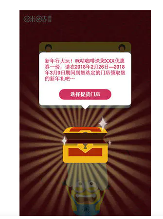

# addEventListener

其第三个参数

有两个形式

**options**

- capture 默认是false 是否为事件捕获时触发
- once 默认为false 是否只调用一次
- passive 默认false 永远不会调用preventDefault

**capture**

单独设置是否捕获

# 如何组织事件冒泡

- event.stopPropagation( ) 这个也可以阻止事件捕获
- if(event.target === this)

# 事件委托

事件委托的原理就是使用事件冒泡

## 案例：模态框点击外侧关闭效果的实现

模态框是整个全屏幕的

红色按钮点击跳转连接

白色对话框点击无效

灰色部位点击关闭

- 我们给整个模态框的div加上事件点击关闭
- 给红色按钮点击跳转
- 白色框禁止事件冒泡：event.stopPropagation()

