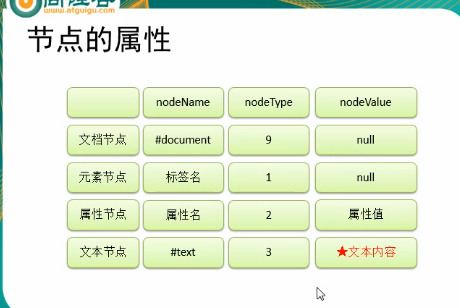

# Dom 

Document Object Model 文档对象模型

文档：整个HTML页面文档

对象：对象表示将网页的每一个部分都转换为了一个对象

模型：使用模型来表示对象之间的关系，这样方便我们获取对象

# 节点

Node，构成网页最基本的部分，网页中的每一个部分都可以称为一个节点

html标签，属性，文本，注释，整个文档都是一个节点

# DOM中所包含对象

Dom Document 指代html文档

Dom Element 指代表示 HTML 元素。（元素节点、文本节点、注释节点的子节点）

Dom Attribute Attr 对象表示 HTML 属性。

Dom Event 事件状态