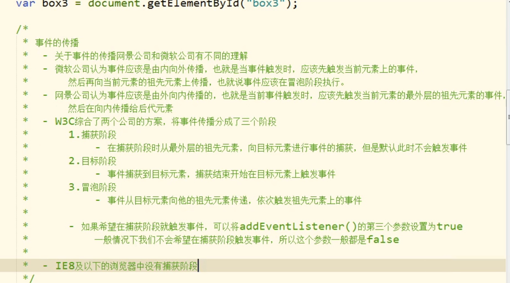

# 概念

当事件的响应函数<font color='orange'>被触发时</font>传递进响应函数，浏览器每次都会将一个<font color='orange'>事件对象(event)作为实参传递进响应函数</font>

在事件对象中<font color='orange'>封装了当前事件相关的一切信息</font>，比如鼠标坐标，键盘那个按键被按下，鼠标滚轮滚动的方向。

# 基本使用

```js
div.onmousemove = function(event){
    //鼠标移入事件
    //event事件对象被当作实参传入函数中
    event = event||window.event; //解决兼容问题
    var x= event.clientX;
    var y = event.clientY;//得到鼠标的x，y坐标（相对可见窗口）
}
```

IE8以下浏览器event对象不是作为实参传入响应函数，而是在window 中

# div跟随鼠标移动例子

clientX

clientY

得到的是鼠标相对于可见窗口的XY值

pageX

pageY

得到的是相对于页面的XY值

```js
getElementsByTagName('body')[0];
    let box = document.getElementById('box1');
    body.style.height = '1000px';//给body设置一个高度让其出现滚动条
    body.onmousemove = function(event){
      event = event || window.event;//兼容IE8
      let mouseX = event.clientX;//这里获取的是相对可见窗口的坐标，而定位偏移量是相对整个页面的
      let mouseY = event.clientY;
      
      //防止滚动出现BUG
      //chorme 认为滚动条出现在body上 其他浏览器认为在html上
      //获取滚动条滚动的长度
      let scrollTop = document.scrollTop ||document.documentElement.scrollTop; 
      let scrollLeft = document.scrollLeft||document.documentElement.scrollLeft;
      box.style.left = mouseX+scrollLeft+'px';//这里记得加px
      box.style.top = mouseY+scrollTop+'px';
    }
```

# 事件的冒泡

就是事件的向上传导，当后代元素的事件被触发时，其祖先元素的相同事件也会被触发

可以使用事件对象来阻止冒泡

```js
box1.onclick = function(event){
 event = event||window.event;
 event.cancelBubble = true;
}
```

# 事件的委派

指的是将事件统一绑定给元素的共同的祖先元素，这样当后代元素上的事件触发时候，会一直冒泡到<font color='red'>祖先元素从而祖先元素的响应函数来处理事件。</font>

事件委派时利用了冒泡，<font color='red'>通过委派可以减少事件的绑定次数，提高程序性能</font>

 

通过事件对象的属性target可以获取触发事件的元素

如果该元素是我们希望触发的元素则执行该方法

```js
if(event.target.className == 'link'){
    //event.target.tagName ==‘LI’
 alert('执行');
}
```

#  事件的绑定

  使用 对象.事件 = 函数的形式绑定响应函数，它只能同时为一个元素的一个事件绑定

一个响应函数，绑定多个就会覆盖

 通过addEventListener()也可以绑定

参数1.事件的字符串，不要on

​    2.回调函数，当事件触发时该函数被调用

​    3.是否在捕获阶段触发事件，需要传一个布尔值，一般都传false

该函数中的this是绑定事件的对象

该函数不兼容IE8 以下，用attachEvent() 以下给出一个兼容bind函数(该函数中的this是window）

```js
function bind(obj,eventStr,callback){
    if(obj.addEventListener){
        //大部分浏览器兼容的方式
        obj.addEventListener(eventStr,callback,false);
    }else{
        /*
        *使用匿名函数传入回调函数，自己拿回回调函数的调用方法权限
        */
        /*IE8以下*/
        obj.attachEvent('on'+eventStr,function(){
            //在匿名函数中使用call改变this指向
            callback.call(obj);
        })
    }
}
```

# 事件的传播




# 拖拽源码

```js
function drag(obj) {
    obj.onmousedown = function (event) {
      //为保证鼠标保持在点击位置计算鼠标在box中的偏移量
      let ol = event.clientX - obj.offsetLeft;
      let ot = event.clientY - obj.offsetTop;
      //在单击事件中绑定鼠标移动事件
      document.onmousemove = function (event) {
        let x = event.clientX;
        let y = event.clientY;

        obj.style.left = x - ol + 'px';
        obj.style.top = y - ot + 'px';
      }

      //在单击事件中绑定鼠标松开事件，原因是鼠标松开事件结束后要清空该事件，则没有绑定该函数所以不会触发第二次
      document.onmouseup = function () {
        //先取消鼠标移动事件，松开时固定当前位置
        document.onmousemove = null;
        //再取消鼠标松开事件
        document.onmouseup = null;

      }
    }
  }
```

# 阻止浏览器事件默认行为

比如input框里的按键按下在框中显示

超链接跳转等默认事件

用obj.onclick绑定事件时 return false来取消

用addeventListener 用event.preventDefault