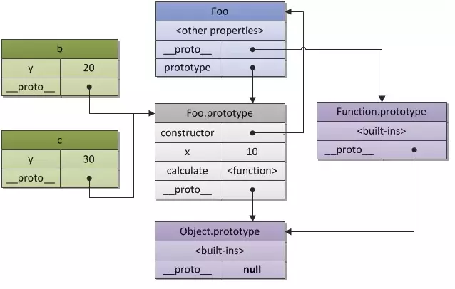
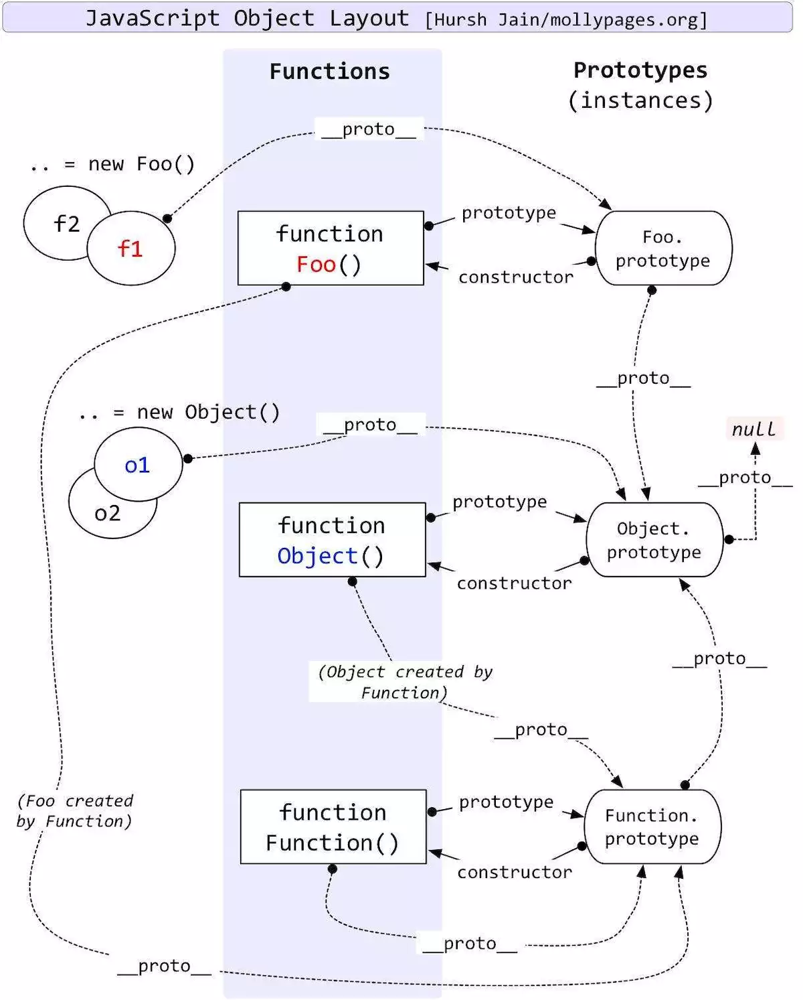

# 原型

创建的每一个函数，解析器都会向函数中添加一个属性prototype

这个属性对应着一个对象，这个对象就是原型对象

如果函数作为普通函数调用，prototype没有任何作用

当函数以构造函数的形式调用时，它创建的对象（实例）都会有一个隐含的属性指向该构造函数的原型对象，通过`__proto__`来访问该属性

原型对象相当于一个公共的区域，所有实例都可以访问到这个对象，我们可以将对象中共有的内容，统一设置到原型对象中。

当访问对象的一个属性或者方法时，它会先在对象自身中寻找，如有则直接使用，没有则会去原型对象中寻找，如果找到则直接使用

当我们创建构造函数的时候，可以将共有的属性和方法统一添加到原型对象中，

这样不用分别对每一个对象添加，也不会影响到全局的作用域就可以使得每个对象都有这个方法和属性了

## **prototype:显式原型**

>   prototype属性，它是**函数所独有的**，它是从**一个函数指向一个对象(实际上是一个空的Object对象)**。它的含义是**函数的原型对象**，也就是这个函数（其实所有函数都可以作为构造函数）所创建的实例的原型对象; 这个属性是一个指针，指向一个对象，这个对象的用途就是包含所有实例共享的属性和方法（我们把这个对象叫做原型对象）;

## `__proto__`:隐式原型

>   `__proto__` 是原型链查询中实际用到的，它总是指向 prototype，换句话说就是指向构造函数的原型对象，它是**实例对象独有的。**注意，为什么Foo构造也有这个属性呢，因为再js的宇宙里万物皆对象，包括函数；指向构造函数的显示原型属性

> 根据以上的概括我们能知道Foo构造函数_proto_指向的是他的构造函数的原型对象，它的构造函数是Function, 也就是说Foo的_proto_指向Function.prototype, 我们再看到左边绿色的a和b函数的_proto_指像的是Foo.prototype,因为他们是通过 new Foo实例化出来的，它们的构造函数就是Foo(), 即a._proto_ = Foo.prototype； 接着我们来看看最右边紫色的模块Function.prototype, 它的_proto_指针指向的是Object.prototype,Object._proto_又为null.。于是我们就可以得出：在原型链中的指向是，实例 → 构造函数的原型函数 → Function.prototype → Object.protype → null ;

## constructor：

  我们看到途中最中间灰色模块有一个constructor属性，这个又是做什么用的呢？

每个函数都有一个原型对象，该原型对象有一个constructor属性，指向创建对象的函数本身。

