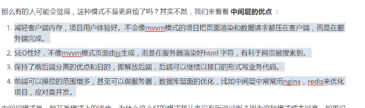

# 特点

1. 事件驱动：拥有事件循环类似js的事件执行顺序

2. 非阻塞IO

3. 轻便

# 用处

## 编程中间层

# node中的JavaScript

- EMCAscript（没有BOM、DOM）
- 核心模块
- 第三方模块
- 用户自定义模块

## 核心模块

Node为JS提供了很多服务器级别的API，这些API绝大多数都被包装到一个具名的核心模块了。

例如文件操作的`fs`核心模块，http服务构建的`http`模块，`path`路径操作模块、`os`操作系统信息模块

核心模块直接使用require进行模块加载

