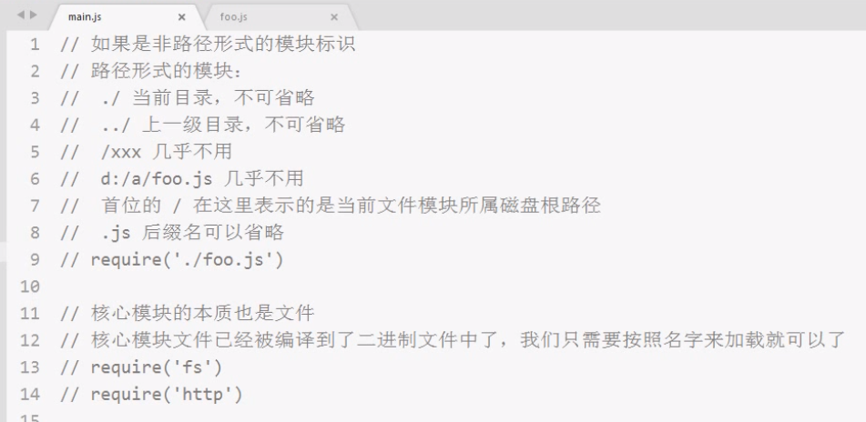
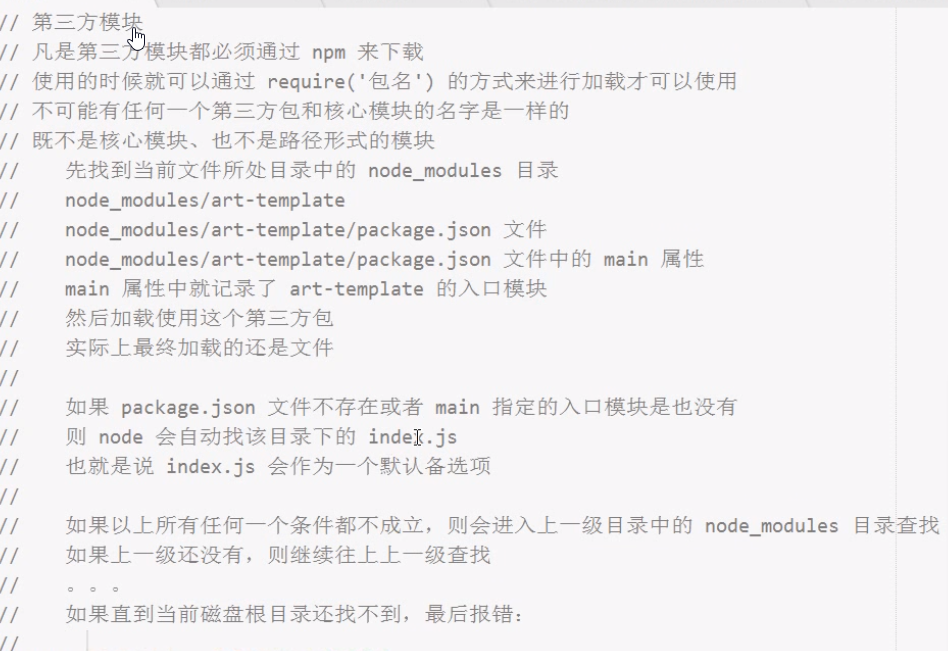
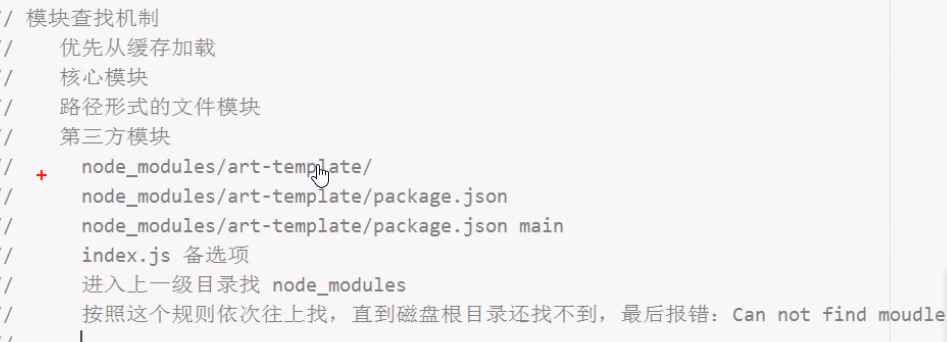

## 导出

```javascript
module.exports = {}
```

以上只导出一个对象/属性/方法

```javascript
exports.c=c
exports.add=(a,b)=>a+b
```

 以上可以导出多个

## 导入

```javascript
let c = require('./文件名.js')
```

<span style='color:red'>没有带有路径，引用的是当前文件所在当前目录下的node_modules目录下的模块。</span>

commonjs引用模块只在<font color='cornflowerblue'>第一次被使用时执行一次（优先从缓存加载）</font><span style='color:red'>是值得拷贝</span>

 ```js
//c={} 方法一导出

//c.c=c
//c.add=funciton 方法二导出
 ```


# 原理

node内部有一个module对象，其中有一个exports对象

```js
module = {
  exports:{
    
  }
}
```

默认在导出模块的最后一句有

```js
return module.exports
```

exports 是 module.exports的一个引用

```js
log(exports===module.exports) //true
exports.a='aaa'
exports ={}
expotrs.a='bbb'
//最后导出aaa
```

<font color='red'>因为当exports给一个新的对象时，就会成为新对象的引用，跟 module.exports毫无关系</font>

但是最后导出的还是module.exports的内容，所以在给exports一个新的引用类型前的赋值生效

<font color='cornflowerblue'>给module.exports重新赋值后 exports赋值也会失效</font>


# require加载规则

优先从缓存加载

标识符分析





