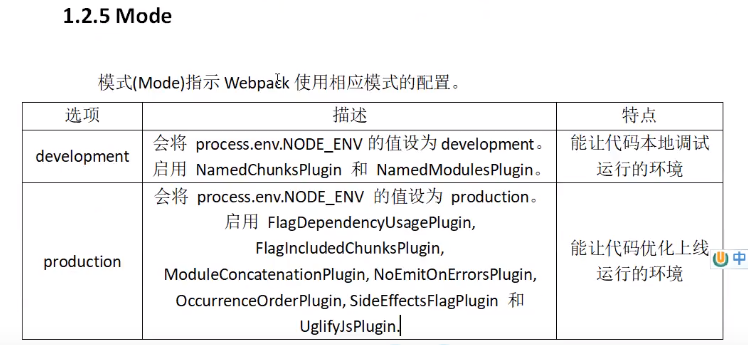

# Entry

入口指示webpack以那个文件为入口起点开始打包，分析构建内部依赖图

# output

输出指示webpack打包后资源bundles输出到那里去，以及如何命名

# loader

loader让webpack去处理那些非JS的文件，如LESS文件，webpack本身是只能处理js文件的

# Plugins

插件可以用于执行范围更广的任务，插件的范围包括，从打包到优化和==压缩==，一直到重新定义环境中的变量等。

# Mode

