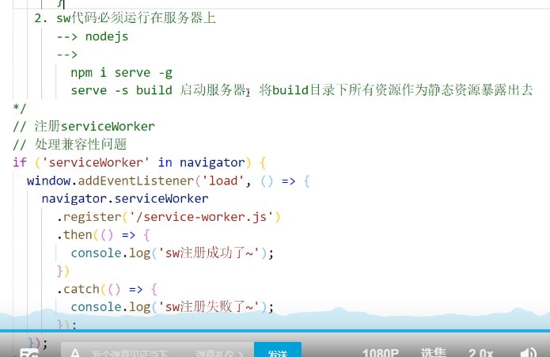

## 开发环境性能优化

- 优化打包速度
- 优化代码调试

## 生产环境性能优化

- 优化打包速度
- 优化代码运行的性能

## 开发环境

### HMR 热模块替换

一个模块发生变化，只会重新打包这一个模块，而不是打包全部模块

样式文件：可以使用HMR功能，因为style-loader内部实现了（开发环境是用style-loader）

js:不能使用HMR，

```js
if (module.hot){
  //进入该方法说明开启hmr模式
  module.hot.accept('./print.js',function(){
    //该方法监听print.js文件的变化，一旦发生变化，其他模块不会重新打包构建
    //会执行后面的回调函数
    print()
  })
}
//改方法只能对非入口文件使用
```


html：没有HMR，而且开启HMR后导致不能热更新，需要在entry中加入html文件入口

`entry:[./src/js/index.js , ./src/index.html]`(html只有一个，不需要使用HMR)

devServer中内置该功能 

```js
devServer:{
  contentBase:resolve(__dirname,'build'),
  compress:true,
  port:3000,
  //开启HMR功能
  hot:true
}
```

### source-map

一种提供源代码到构建后代码的映射

使用`devtool:souce-map`

eval-source-map 更快，内联source-map 开发使用这种

生产环境：内联会让代码体积更大

所以用source-map

隐藏源代码使用hidden-source-map

### oneOf

提升构建速度，将loader分类

```js
module:{
  rules:[
    {
      //eslint-loader
    },
    oneOf:[
    //其他loader
    //babel-loader
    //这样 eslint-loader不会和其他loader干扰
  ]
  ]
}
```

### 缓存

#### babel缓存

在babel-loader中的options中在 presets加入

`cacheDirectory:true`

#### 文件资源缓存

文件资源存储的时候

文件名filename:xxx[hash:10].js

- hash:每次webpack构建都会生成一个唯一的hash值。问题：因为css和JS使用同一个hash值，如果重新打包，会导致所有的缓存失效。
- chunkhash：根据chunk生成的hash。如果打包来源于同一个chunk，那么hash值就是一样。因为css是js中被引入的，所以属于一个chunk（chunkhash根据不同的入口文件(Entry)进行依赖文件解析、构建对应的chunk，生成对应的哈希值。）
- contenthash：根据文件内容生成hash值，不同文件hash值一定一样

### tree shaking

- 必须使用es6模块化
- 开始production环境
- 在package.json中配置 `"sideEffects":[*.css]`否则会把CSS等文件删掉

### 代码分块

将不同的文件进行单独打包

#### 多入口

每个入口单独打包成一个chunk

```js
entry:{
  index:'./src/js/index.js',
  test:'./src/js/test.js'
}
```

#### 配置

- 可以将 node_modules中的代码单独打包成一个chunk最终输出
- 自动分析多入口chunk中，有没有公共的文件。如果有会打包成一个单独的chunk

```js
optimization:{
  splitChunks:{
    chunks:'all'
  }
}
```

#### 使用js代码使得文件分块打包

使用import动态导入语法，将某个文件单独打包

```js
import(/*webpackChunkName:'test'*/'./test')
.then(({fun})=>{
  //文件加载成功，结构赋值获得函数
  console.log(fun)
}).catch(()=>{
  console.log('文件加载失败')
})
```

### 预加载技术

懒加载：当文件需要的时候再加载

正常加载：并行加载。同时加载多个文件，没有前后顺序。

预加载 prefetch：等其他资源加载完毕，浏览器空闲了再偷偷加载

```js
import(/*webpackChunkName:'test',webpackPrefetch:true*/'./test').then(({fun})=>{
  log(ffun)
})
```

### PWA

渐进式网络开发引用技术（离线可以访问）

使用workbox-webpack-plugin插件



### 多进程打包

thread-loader

在`use`加入这个loader开启多进程打包

开启多进程打包要600ms只有消耗工作较长的时候才开启多进程打包


